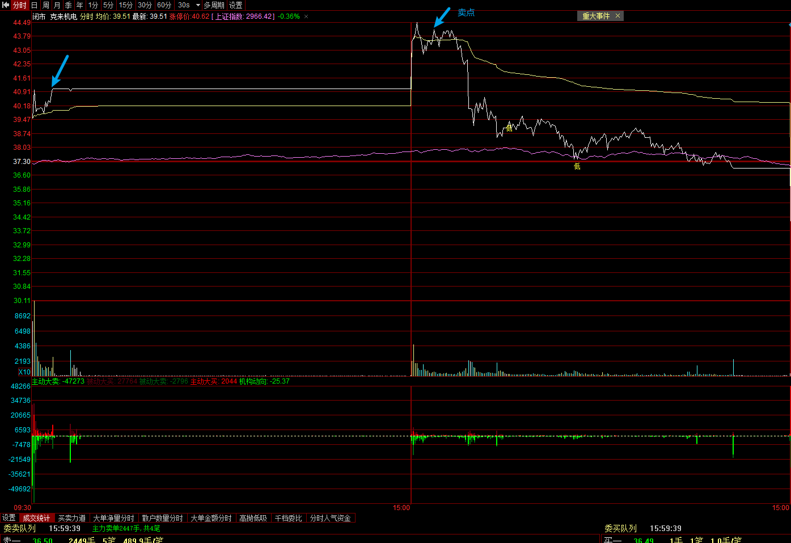
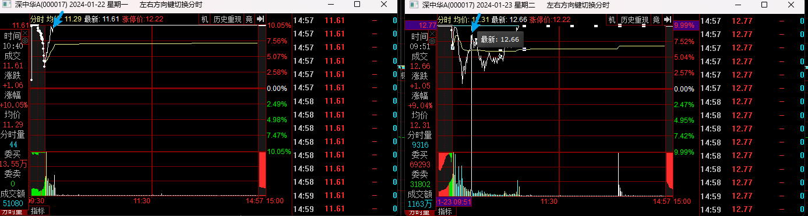
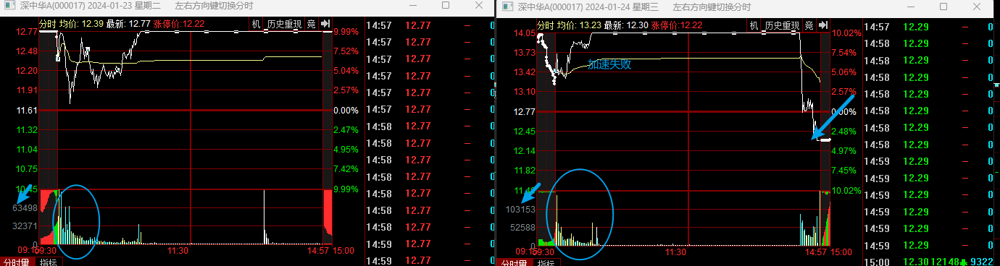

# 墨守心法

> 当一则消息被证伪前，那就是真消息

1、强者思维

明天要比今天强，该强不强即是弱，该弱不弱即是强，二次加速不能接

2、买入看支撑，卖出看压力

避免随机交易，可以减少许多苦恼，买卖前一定要观察板块共振，板块向下个股向上非买点，板块向上个股向上才是买点

3、量价关系

量能已超昨日同时间点，资金无向上动作，可以先离场观察

当个股该加速的时候却爆量，说明运作资金已经离场，此刻不宜进场

4、强势龙头买点

低位爆量弱转强；

分歧转一致；   

龙头首阴； 

5、趋势龙头买点：

天量天价；

爆量当日顶底支撑的低吸；

板块分歧的尾盘低吸

6、顺势而为

避免在下跌趋势中逆势操作，跟随市场主流趋势。

7、低吸为主

在有支撑的情况下低吸，而不是追涨，特别是在主升浪阶段。

8、及时止损

当个股下跌趋势明显且无支撑时，果断止损，避免更大损失。

9、聚焦核心

专注于主线核心个股，避免分散投资在非主线题材上。

10、灵活应对

根据市场情绪和板块轮动情况，灵活调整投资策略。