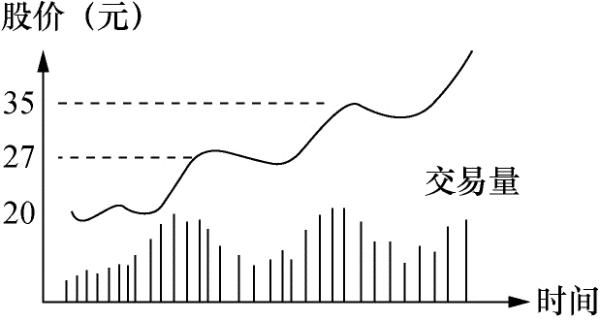

# 趋势跟随策略

> 大钱不存在于股票的日常小波动，大钱只存在大势之内。

股票选好了，什么时候可以买入？同一只股票，为什么有的人可以赚钱，而有的人吃面，这都是买卖时机的选择。

短线选手最重要的就是择时，所谓择时，不是说买入就要盈利，而是买入未来必然盈利，这就是趋势跟随。

但很多人往往趋势跟随变成了追高，最终反而套在山顶；也有很多人买在阶段性高点，容易回本或小赚卖出，从而卖飞。这就是节奏问题。

人性总是厌恶风险，

如果节奏不对，最好先停下来休息，等待合适的时机。

如果你对自己的交易纪律有所担忧，最好是买入后即迅速远离成本线。

## 如何判断趋势行情

首先看资金介入程度，如果资金只是一日游，那么研究趋势没有什么意义了；

其次关注板块是否持续活跃，是否持续有消息刺激，这影响增量资金是否进场；

最重要的是趋势是否形成，趋势一旦形成，便难以扭转，此时应当趁市场分歧上车。

## 如何判断正常运动

只要股票运动正常，便必须按兵不动。炒股高手利弗莫尔特别指明，他炒股的秘诀不是他怎样思考， 而是他在买对了的时候能够把股捂住。

人受到赞扬时会高兴，被指责时会生气。股票也是一样，被追捧时会升，被抛售时会跌，期间可能受一定程度的大户操作而改变升跌的形态，但总体趋势是不会改变的。

无论上涨时的回落，还是暂时的震荡，我们都可以通过成交量判断这是否是正常运动。

一只正常运动的股票，每次上冲的强度通常较上一次更为猛烈。

炒手的任务不仅仅在于确认何时股票运动正常，同样重要的是要能认识股票何时运动不正常。股票这种前进两步、退后一步的过程可能延续一段时间，有时可能是很长的一段时间。这段时间炒手或许在精神上会松懈下来，这是要不得的。因为往往在你松懈下来的时候，股票的运动发生变化。

永远记住一句话，找傻瓜的最佳途径就是令股价暴升，暴升时通常伴随点好消息。必须牢牢记住：股市从来都不错，它总是走自己要走的路，会错的只有人自己。

你所能做的只有追随股市。见到危险信号，不要三心二意，不要存有幻想，把股票全部脱手。几天以后，也许一切又恢复正常，你一样可以重新入场。如果能这样做，你将发现你为自己省下了很多焦虑及学费。