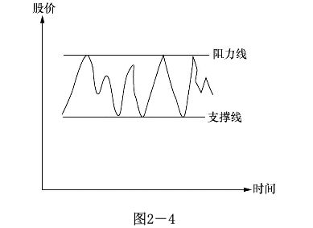
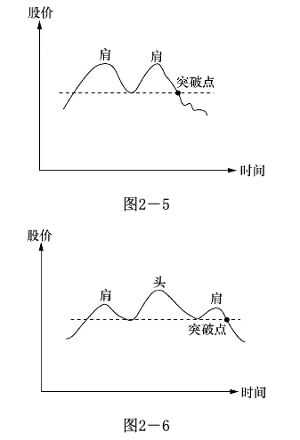
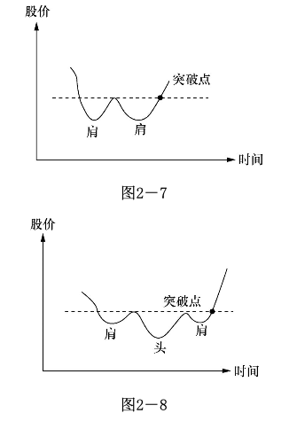
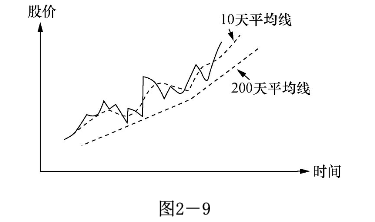
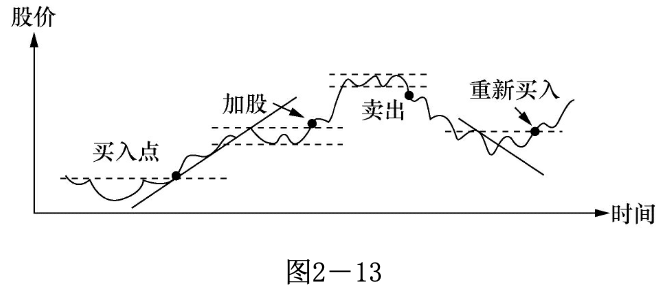
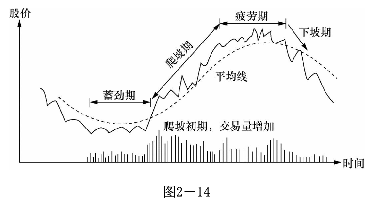

# 学习技术分析

> 炒股不是科学，不需要方法论

“工欲善其事，必先利其器”，当你参与进来的时候，得先了解基本的规则，至于成熟的交易经验，可能就得付出一些学费了。但如果基本的规则都不了解就猛扎进来，那么极大可能要被这市场蹂躏一番，亏钱后还不忘骂上几句。

所谓的技术分歧，其实就是前人积累的经验，站在巨人的肩膀上才能看的更远。要注意的是，经验只是辅导决策，而不是指导决策。这里假设读者已经懂得了基本的知识，比如k线、蜡烛图等。

## 大环境分析

　　 1 、利率：可以这么想，社会的游资数目是一定的，当利率升高时，将钱存入银行的吸引力增加，这将使原先可能进入股市的资金流进银行。同时，利率的升高使公司的借贷成本增加；

　　 2 、税收：企业税增加，企业盈利中的税务支出增加，使得实际盈利减少，股价将往下调整。

　　 3 、汇率：当汇率上调，本国货币升值，增加出口困难，营业额降低，其结果对股价的影响主要是负面的。汇率属国际金融的范畴，它对股价影响的机制极其复杂，通常是国际政治经济角力的结果。

　　 4 、银根松紧：银根松时，市场游资增多，对股票的影响是正面的。银根紧时正好相反。

　　 5 、经济周期：经济周期是市场经济的必然结果。当某种商品短缺，大家一窝蜂地投资于这种商品的生产，随后的结果便是生产过剩。当商品短缺时，价格高昂，生产厂家利润增加，反映在股市便是股价上升。一旦生产过剩，就只得减价销售，有时甚至亏本套现，这样盈利自然降低，股价的表现便是下跌。

　　 6 、通货膨胀：通货膨胀对股价的影响很难估量，通常政府为了控制通货膨胀，会调高利息，对股价的影响主要是负面的。

　　 7 、政治环境：大规模的政治动乱必然带来大规模的经济混乱。战争、政府的频繁更迭、政局的不稳定对股票的影响是负面的。

　　 8 、政府的产业政策：如果政府鼓励某些行业，给予扶持，如在税收上给予减免，融资上给予方便，企业各方面的要求都给予协助，结果自然对股价有正面影响

## 技术面分析

### 走势及走势线

势者，趋势也，趋势难改。

股票升的原因是低的成本收益率吗？是高的红利或是其它堂皇的理由？都不是，只是因为买者多过卖者。概而言之，供需关系。

同样，投资者卖出股票的原因是成本收益率高吗？卖出只是因为股票在跌！

所以你很清楚了，这便是势。既然是势，便有上升势、下降势、横盘势，横盘有高位和低位之分，便有迹可循。投资者便可通过观察和分析势，可以识别趋势的持续性、判断适当的买入或卖出时机，并制定相应的交易策略。

### 支撑线和阻力线

传统来说，当股票在一定的区间波动，把最高点相连便成阻力线，把最低点相连便成支撑线。

但真正的支撑线和阻力线不在图形，而在投资者心理，只有当绝大部分人认为价格便宜愿意入场才叫支撑线，大部分认为价格过高不愿意购买才是阻力线。至于图形，那只不过是持股者的一厢情愿。

如果有人会对这个价格区间持有不同看法，认为价钱太高或太低，这就引出了另外一个重要观点--**分歧**，这里暂且不表。

需要指出的是，阻力线一旦被突破便成了新的支撑线，同样，支撑线一旦被跌破便成了新的阻力线。

### 双肩图和头肩图

随着价钱的升高，买主们开始怀疑价钱是否能超过原来的最高点？卖主也在观察这个最高点是否还像上次一样会带来卖压，使价格的升势挫折。简单地说，市场参与者在观察这次会不会有和上次同样的经历。

在双肩图中，因为无法穿越上次的最高点，市场对价格的看法产生变化，股民对在这点附近持股感到不自在。在股市中，你会看到股价逐步滑落。但假如买力不减，继续穿过上次的最高点，我们就回到升势图去了。

### 移动平均线

平均线的目的主要是用来判定股票的走势。对于短线选手，最重要的是5分钟、10分钟以及30分钟级别的k线。

K线代表的含义取决于其所在的位置，具体情况还要具体分析

| 图形                                                         |    名称    |     应用说明     | 图形                                                         |    名称    |         应用说明         |                             图形                             | 名称     |      应用说明      |
| ------------------------------------------------------------ | :--------: | :--------------: | ------------------------------------------------------------ | :--------: | :----------------------: | :----------------------------------------------------------: | -------- | :----------------: |
|  |   大阳线   |     强烈涨势     |  |   大阴线   |         表示大跌         |  | 大十字线 | 多空势均力敌将变盘 |
|  | 大阳下影线 |     抵挡超强     |  | 大阴下影线 | 多空交战跌后若有支撑反弹 |  | 十字线   |     多方较有利     |
|  | 大阳上影线 |     高档换手     |  | 大阴上影线 |     多空交战空方较强     |  | 十字线   |     空方较有利     |
|  |   小阳线   | 方向不明多方稍强 |  |   小影线   |     方向不定空方稍强     |  | Ｔ字线   |    多方有利转机    |
|  |  上影阳线  | 多方主导但需谨慎 |  | 上影线阴线 |     空方主导但极弱线     |  | 倒Ｔ字线 |      高档小心      |
|  |  下影阳线  |    多方强势线    |  |  下影阴线  |        多方弱势线        |  | 一字线   |     飙涨或飙跌     |
|  |   铁锤线   |   高档差低档佳   |  |   铁锤线   |       高档差低档佳       |                                                              |          |                    |

### DMI

DMI（Directional Movement Index）是一种技术分析指标，用于衡量市场趋势的强度和方向。它由Welles Wilder于1978年提出，并被广泛应用于股票、期货和外汇市场。

DMI指标由三个线组成：+DI（Positive Directional Indicator）、-DI（Negative Directional Indicator）和ADX（Average Directional Index）。

+DI和-DI线用于衡量股票或资产上涨和下跌的强度，以及买入和卖出压力的对比。+DI线表示上升趋势的强度，而-DI线表示下降趋势的强度。当+DI线高于-DI线时，表示上升趋势较强；当-DI线高于+DI线时，表示下降趋势较强。

ADX线用于衡量趋势的强度，而不考虑其方向。ADX值的范围通常在0到100之间。较高的ADX值表示趋势较强，而较低的ADX值表示趋势较弱或市场处于盘整状态。

通过结合+DI、-DI和ADX线的走势，投资者可以了解市场的趋势方向、趋势的强度以及是否存在趋势转折的可能性。例如，当+DI线高于-DI线且ADX值较高时，可能暗示着强势上涨趋势；相反，当-DI线高于+DI线且ADX值较高时，可能暗示着强势下跌趋势。

**需要注意的是，DMI指标并非用于产生具体的买入或卖出信号，而是用于帮助分析市场趋势。**

### BOLL

BOLL（Bollinger Bands）是一种常用的技术分析指标，由约翰·博林格（John Bollinger）于1980年提出。BOLL指标通过在移动平均线周围绘制一组上下两条线，来衡量价格的波动性和价格的极限水平。

BOLL指标由以下三条线组成：

- 中轨（中线）：它是一条移动平均线，通常使用简单移动平均线（SMA）。中轨显示了一段时间内的平均价格水平，常用的参数是20日或者其他时间周期的移动平均线。
- 上轨（上限线）：它是中轨线上方一个标准差的距离，通常使用20日的标准差。上轨线向上或向下扩展，反映了价格波动的高度。
- 下轨（下限线）：它是中轨线下方一个标准差的距离，与上轨线类似。下轨线也向上或向下扩展，反映了价格波动的低度。

BOLL指标的主要作用是提供价格的波动范围和趋势的参考。当价格位于上轨线附近时，意味着市场可能过买，价格可能开始回调或下跌。相反，当价格位于下轨线附近时，意味着市场可能过卖，价格可能开始反弹或上涨。中轨线也可以被视为支撑或阻力水平。

此外，BOLL指标还可以用于判断价格的波动性。当价格的波动性增加时，上下轨之间的距离会扩大，反之亦然。投资者可以通过观察上下轨之间的距离变化，来判断市场的波动性水平。

**需要注意的是，BOLL指标并非用于产生具体的买入或卖出信号，而是用于辅助判断价格的极限水平和波动性。**

## 综合看图

毫无疑问的是，不管是人交易还是电脑交易，交易必须用钱完成；股票升了，一定是买盘胜过卖盘！

无论是个人下单买还是指示电脑下单买，一定有资金在入场，走势图就一定可以反映趋势。最终也就是如下模样：

### 万物皆周期

必须强调，股市操纵可能改变每天的或短期的波动，但不可能改变大势。在任何时期，股票的波动都是波浪形的。每个大波动内包含有很多反向的小波动。平均线将中和这些小波动且指明大趋势。

### 主力资金

图形或许可以短期操纵，但有一点无法作假，没错，那就是交易量和交易价格。股价可以上涨也可以下跌，交易量可以增加也可以减少，但不可能由股价上涨到股价下跌，成交量还是不变的。你必须明锐观察到量能关系的改变，因为这通常意味着你需要采取行动了。其中涉及到的量价关系又是一门大学问，这里暂且不表，主要讨论一下主力资金。

所谓雁过留声，主力资金的操作也会留下痕迹，我们需要通过判断量价关系来确认庄家的操作过程。

但人跟人不一样，庄跟庄也不一样。

按照吸筹、洗盘、拉抬、整理、拔高、出货的程式的做庄风格叫标准庄。很有些学院派风格。

也有高位吸筹，迅速拉抬，坚决出货的技术派。

行情来得快，来得猛，去得也急。我们必须要密切跟踪主力痕迹才有可能分一杯羹。