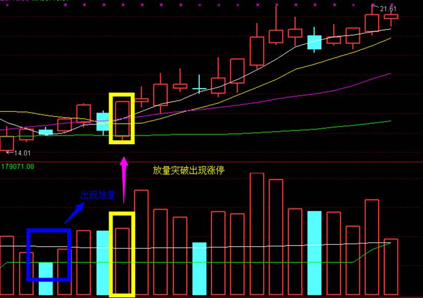

# 选择高流动性股票

> 如果在市场中最强势的股票上都赚不到钱，还有什么理由相信可以在其他股票上赚钱

一只股票，如果没有主力资金参与，如果没有高流动性，那么就无需关注。

选择市场流动性好的股票，其目的在于交易时获得更好的买卖价格。

我们选择核心股、龙头股都是基于以上原因。

趋势、资金以及活跃度，对于个股选择来说至关重要。

你能够相信在一只股票无人问津的股票中赚到钱吗？

## 常用选股公式

### 强势股

热门板块 + 10（30）日涨幅榜

### 百日地量

超过五个交易日失去时效性，万万不可凑合

买阴不买阳，买低开不买高开，回踩买入

持有时间在一周在两周时间，最多不超过两周，或者是获利20%走人 

